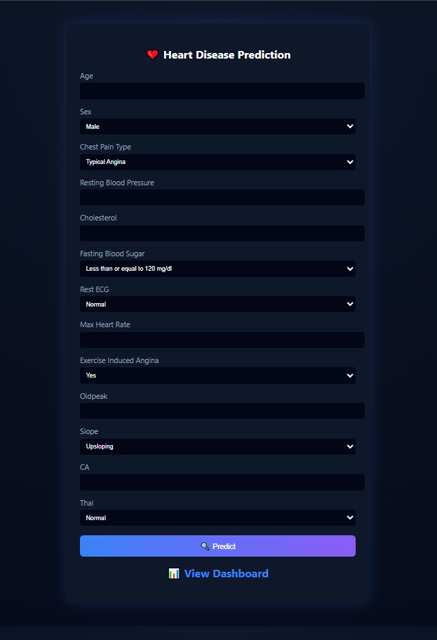
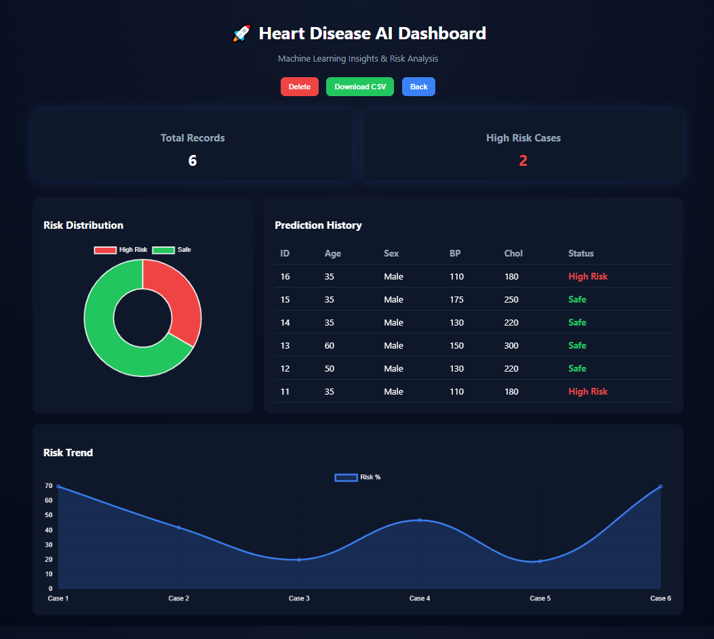

# 💓 Heart Disease Prediction System

A Machine Learning based web application that predicts heart disease risk using patient health parameters.


## Tech Stack
- Python
- Flask
- Scikit-learn
- Pandas
- HTML / CSS / JavaScript
- SQLite
  

## 📌 Project Overview

This project uses Machine Learning algorithms to predict whether a person is at risk of heart disease based on medical inputs such as age, cholesterol, blood pressure, chest pain type, ECG results, etc.

The system provides:

- Heart disease prediction
- Risk level (Low / Moderate / High)
- Analytics dashboard
- Prediction history
- CSV export reports

---

## 🚀 Technologies Used

- Python
- Flask
- Scikit-learn
- Pandas
- NumPy
- SQLite
- HTML
- CSS
- JavaScript
- Chart.js

---

## 🤖 Machine Learning Models Used

- Logistic Regression
- Random Forest
- Support Vector Machine (SVM)

### Final Selected Model:
✅ Random Forest Classifier

### Accuracy Achieved:
✅ 98.5%

---

## 📊 Dataset Information

- UCI Heart Disease Dataset
- Total Records: 1025
- Features: 13 Input Features + 1 Target Output

---

## 🧾 Input Features

1. Age  
2. Sex  
3. Chest Pain Type  
4. Resting Blood Pressure  
5. Cholesterol  
6. Fasting Blood Sugar  
7. Rest ECG  
8. Max Heart Rate  
9. Exercise Induced Angina  
10. Oldpeak  
11. Slope  
12. CA  
13. Thal

---

## 💻 System Features

✅ User Friendly Interface  
✅ Real-time Prediction  
✅ Risk Percentage  
✅ Dashboard Analytics  
✅ Prediction History  
✅ Delete Records  
✅ Download CSV Report

---

## 📷 Screenshots

<h3>Main Prediction Page</h3>


<h3>Dashboard</h3>



---

## ▶️ How to Run Project

```bash
pip install -r requirements.txt
python app.py
